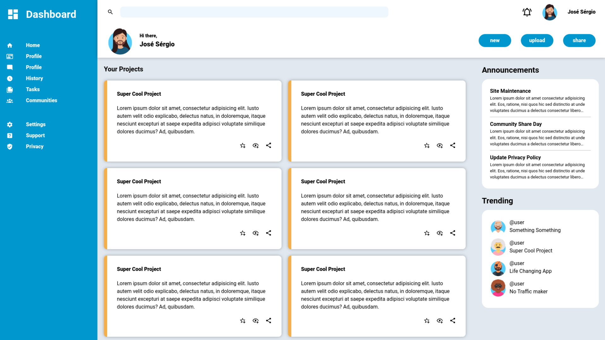

# Project Admin Dashboard

## Description

This project is part of the odin project curriculum, the main goal is to create a admin dashboard using only HTML and CSS to create the layout and the structure of the page with the focus of learning how to use CSS Grid.

## Preview

    
   

## Live Demo

[Live Demo Link](https://mrescappe.github.io/Project-Admin-Dashboard/)

## Made with

- 
- 

## What I learned

- How to use CSS Grid to create a layout.

## Licensa de uso

- MIT. See [LICENSE](/LICENSE) for more details.
- Copyrigth (c) 2024 [José Sérgio](https://github.com/MrEscappe)
